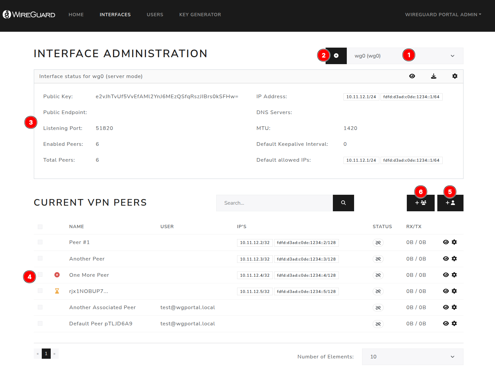

This documentation section describes the general usage of WireGuard Portal. 
If you are looking for specific setup instructions, please refer to the *Getting Started* and [*Configuration*](../configuration/overview.md) sections, 
for example, using a [Docker](../getting-started/docker.md) deployment.

## Basic Concepts

WireGuard Portal is a web-based configuration portal for WireGuard server management. It allows managing multiple WireGuard interfaces and users from a single web UI.
WireGuard Interfaces can be categorized into three types:

 - **Server**: A WireGuard server interface that to which multiple peers can connect. In this mode, it is possible to specify default settings for all peers, such as the IP address range, DNS servers, and MTU size.
 - **Client**: A WireGuard client interface that can be used to connect to a WireGuard server. Usually, such an interface has exactly one peer.
 - **Unknown**: This is the default type for imported interfaces. It is encouraged to change the type to either `Server` or `Client` after importing the interface. 

## Accessing the Web UI

The web UI should be accessed via the URL specified in the `external_url` property of the configuration file.
By default, WireGuard Portal listens on port `8888` for HTTP connections. Check the [Security](security.md) section for more information on securing the web UI.

So the default URL to access the web UI is:

```
http://localhost:8888
```

A freshly set-up WireGuard Portal instance will have a default admin user with the username `admin@wgportal.local` and the password `wgportal-default`. 
You can and should override the default credentials in the configuration file. Make sure to change the default password immediately after the first login!


### Basic UI Description


As seen in the screenshot above, the web UI is divided into several sections which are accessible via the navigation bar on the top of the screen.

1. **Home**: The landing page of WireGuard Portal. It provides a staring point for the user to access the different sections of the web UI. It also provides quick links to WireGuard Client downloads or official documentation.
2. **Interfaces**: This section allows you to manage the WireGuard interfaces. You can add, edit, or delete interfaces, as well as view their status and statistics. Peers for each interface can be managed here as well.
3. **Users**: This section allows you to manage the users of WireGuard Portal. You can add, edit, or delete users, as well as view their status and statistics.
4. **Key Generator**: This section allows you to generate WireGuard keys locally on your browser. The generated keys are never sent to the server. This is useful if you want to generate keys for a new peer without having to store the private keys in the database.
5. **Profile / Settings**: This section allows you to access your own profile page, settings, and audit logs. 


### Interface View



The interface view provides an overview of the WireGuard interfaces and peers configured in WireGuard Portal.

The most important elements are:

1. **Interface Selector**: This dropdown allows you to select the WireGuard interface you want to manage. 
   All further actions will be performed on the selected interface.
2. **Create new Interface**: This button allows you to create a new WireGuard interface.
3. **Interface Overview**: This section provides an overview of the selected WireGuard interface. It shows the interface type, number of peers, and other important information.
4. **List of Peers**: This section provides a list of all peers associated with the selected WireGuard interface. You can view, add, edit, or delete peers from this list.
5. **Add new Peer**: This button allows you to add a new peer to the selected WireGuard interface.
6. **Add multiple Peers**: This button allows you to add multiple peers to the selected WireGuard interface. 
   This is useful if you want to add a large number of peers at once.